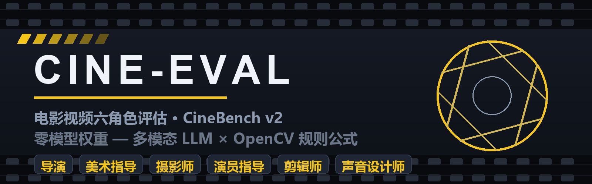
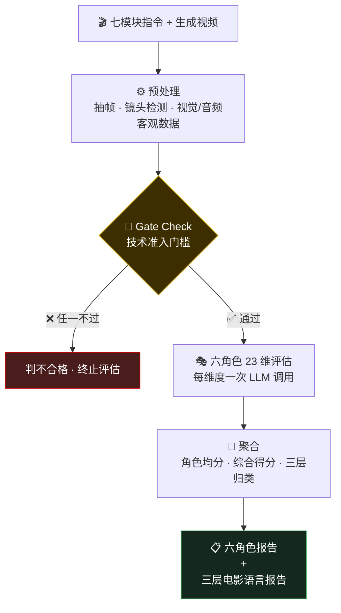

<div align="center">



# CineEval · 电影视频六角色评估

**一段 30 秒的 AI 生成片段背后，是导演、美术指导、摄影师、演员指导、剪辑师、声音设计师六个人的专业判断。**

[](https://www.python.org/)
[](https://opencv.org/)
[](https://numpy.org/)
[]()
[](https://ffmpeg.org/)
[]()

</div>

---

**CineEval** 按 **CineBench v2** 框架评估「AI 生成视频」与「电影指令」的对齐度：模拟电影工业六个专业角色做 **23 个维度**打分，输出双视角报告（六角色报告 + 三层电影语言报告）。

它不问模型"能不能出视频"，只问模型**"能不能执行专业电影指令"**。

> [!NOTE]
> **零模型权重**：原 CineBench v2 中由 CLIP / TransNetV2 / DPFlow / DeepFace 支撑的维度，全部替换为两条路——**多模态 LLM 看抽帧判断**，或 **OpenCV/NumPy 纯算法规则公式**。整个 skill 不需要下载任何模型权重。

---

## 📑 目录

- [✨ 特性](#-特性)
- [🎬 工作流程](#-工作流程)
- [🚀 快速开始](#-快速开始)
- [🎭 六角色 · 23 维总表](#-六角色--23-维总表)
- [🧭 三种评分路径](#-三种评分路径)
- [📊 聚合与三层报告](#-聚合与三层报告)
- [🛠 scripts 清单](#-scripts-清单)
- [🧩 特殊情况](#-特殊情况)
- [❓ FAQ](#-faq)

---

## ✨ 特性

- 🎭 **六角色 23 维** — 导演 / 美术指导 / 摄影师 / 演员指导 / 剪辑师 / 声音设计师，各司其职
- 🚪 **Gate Check 准入门槛** — 物理失真、画面断裂不过线，直接判不合格，不浪费评分
- ⚖️ **三种评分路径** — 纯 LLM（激发型）/ 混合 0.4+0.6（融合型）/ 规则为主（抑制型），立场分明
- 🧾 **每维度具体 Prompt** — `build_prompt.py` 按维度生成最终 Prompt：指令摘录、规则数据、材料清单、检查点全部嵌入
- 🔌 **零权重规则公式** — 镜头检测 / 转场分类 / 光流运镜 / 调色板 / 清晰度焦点 / 音频统计，全部 OpenCV + NumPy
- 🧮 **聚合不手算** — 角色均分、N/A 剔除、可选调权、三层归类、Markdown 报告骨架，一个脚本搞定
- 🧩 **可编排** — `--json` 输出路由元数据，给不同维度分配不同模型（如声音维度走音频模型）

---

## 🎬 工作流程



**Gate Check 六项**：基本可辨识性 · 物理合理性 · 时间连续性 · 最低视觉质量 · 最低声音质量（如有声） · 声画基本同步（如有声）——任一不过，整体判不合格。

---

## 🚀 快速开始

### 安装

```bash
pip install opencv-python numpy   # 必装（build_prompt.py 只用标准库）
# ffmpeg 可选：仅声音维度需要（命令行调用），缺了 S1~S4 自动标 N/A
```

### 环境自检

```bash
python scripts/check_env.py
```

### 一条流水线

```bash
VIDEO=path/to/video.mp4

# 0️⃣ 环境自检（可省）
python scripts/check_env.py

# 1️⃣ 预处理：镜头检测 → 抽帧 → 视觉/音频客观数据
python scripts/shot_detect.py     $VIDEO --expect-shots 3 --output shots.json
python scripts/extract_frames.py  $VIDEO --outdir frames/ --shots shots.json
python scripts/visual_analysis.py $VIDEO --shots shots.json --output visual.json
python scripts/audio_extract.py   $VIDEO --output audio.json   # 可选，需 ffmpeg

# 2️⃣ 生成每个维度的具体评估 Prompt（示例：B1 运镜轨迹）
python scripts/build_prompt.py B1 --script script.txt \
    --visual visual.json --shots shots.json --manifest frames/manifest.json
#    --all 一次生成全部 23 维；--json 输出路由元数据

# 3️⃣ 把 Prompt + 对应帧图/音频交给多模态 LLM，收集 23 个维度的分数

# 4️⃣ 聚合出报告
python scripts/aggregate_scores.py scores.json --md report.md
```

> `script.txt` 是七模块指令原文：`【场景设定】【角色描述】【叙事指令】【摄影指定】【剪辑指令】【声音指令】【情绪风格】`。

---

## 🎭 六角色 · 23 维总表

<details open>
<summary><b>🎬 导演</b>（3 维，纯 LLM）</summary>

| 维度 | 评什么 |
|------|--------|
| **A1** 叙事完整性 | 是否传递清晰叙事事件，与③对齐 |
| **A2** 场景逻辑一致性 | 物品、空间关系前后是否一致 |
| **A3** 情绪节奏弧 | 情绪起伏曲线与⑤⑦是否一致 |

</details>

<details>
<summary><b>🎨 美术指导</b>（4 维）</summary>

| 维度 | 评什么 | 路径 |
|------|--------|------|
| **PD1** 场景与道具设计 | 空间布局、道具丰富度、类型感 | 纯 LLM |
| **PD2** 色彩方案 | 配色是否服务于指定情绪 | 混合 |
| **PD3** 风格自洽 | 视觉元素是否同一风格体系 | 纯 LLM |
| **PD4** 场景跨镜头一致 | 场景/道具细节跨镜头一致性 | 规则为主 |

</details>

<details>
<summary><b>📷 摄影师</b>（4 维）</summary>

| 维度 | 评什么 | 路径 |
|------|--------|------|
| **B1** 运镜轨迹 | 推拉摇移的方向/速度与④一致 | 混合 |
| **B2** 焦点与景深 | 焦点位置、虚实关系与④一致 | 混合 |
| **B3** 构图质量 | 构图是否符合电影级审美 | 纯 LLM |
| **B4** 光影氛围 | 光线方向、质感、色温、明暗 | 混合 |

</details>

<details>
<summary><b>🕺 演员指导</b>（4 维，纯 LLM）</summary>

| 维度 | 评什么 |
|------|--------|
| **C1** 行为自然度 | 动作流畅、无机械感、合物理 |
| **C2** 情绪表达 | 表情/肢体是否传递指定情绪 |
| **C3** 空间互动 | 角色距离/朝向/互动合理性 |
| **C4** 演员跨镜头一致 | 外观/服装/状态跨镜头一致 |

</details>

<details>
<summary><b>✂️ 剪辑师</b>（4 维）</summary>

| 维度 | 评什么 | 路径 |
|------|--------|------|
| **D1** 转场方式 | 硬切/叠化/淡入淡出与⑤一致 | 规则为主 |
| **D2** 切换节奏 | 切换频率、时长分布与⑤一致 | 规则为主 |
| **D3** 轴线规则 | 转场后视线/空间方向一致性 | 纯 LLM |
| **D4** 镜头数量 | 实际镜头数与⑤指定一致 | 纯规则打分 |

</details>

<details>
<summary><b>🔊 声音设计师</b>（4 维，需音频能力模型）</summary>

| 维度 | 评什么 |
|------|--------|
| **S1** 对白质量 | 对白清晰度、口型、语气匹配 |
| **S2** 声音设计 | 环境音/音效/层次与⑥一致 |
| **S3** 声画同步 | 声音事件与视觉事件时间对齐 |
| **S4** 音乐情绪 | 配乐风格与情绪匹配 |

> 评估模型无音频能力时，S1~S4 全部标 N/A，综合得分按其余角色均分计算。

</details>

---

## 🧭 三种评分路径

不同维度的"脾气"不同，Prompt 的立场也不同——由 `build_prompt.py` 自动选择：

| 路径 | 立场 | 谁在用 | 打分方式 |
|------|------|--------|---------|
| 🔥 **纯 LLM** | 激发型：模型全权逐步推理 | A1~A3、PD1/PD3、B3、C1~C4、D3、S1~S4 | LLM 直接打 1~5 |
| ⚖️ **混合** | 融合型：客观数据 × 画面判断 | PD2、B1/B2/B4 | `规则分×0.4 + LLM分×0.6` |
| 🛡 **规则为主** | 抑制型：只核验不越权 | PD4、D1/D2/D4 | 照抄规则分，矛盾才 ±1 |

---

## 📊 聚合与三层报告

**1~5 分锚定**：`5 优秀 · 4 良好 · 3 合格 · 2 不合格 · 1 失败`（N/A 维度不计入任何均分）。

```
角色均分 = 该角色各维度（不含 N/A）算术平均
综合得分 = 六角色均分（不含 N/A 角色）算术平均，可选调权
```

**三层电影语言报告**——一眼定位能力短板：

| 层级 | 维度 | 解读 |
|------|------|------|
| 🎯 镜头内运动（11 项） | B1~B4、C1~C3、PD1~PD3、A2 | 单镜头生成质量 |
| 🔀 镜头间过渡（5 项） | D1~D3、PD4、S3 | 镜头衔接能力 |
| 🧩 组合逻辑（7 项） | A1、A3、D4、C4、S1/S2/S4 | 成片叙事能力 |

> 典型结论：镜头内高分 + 组合逻辑低分 → **「优秀的单镜头生成器，尚不具备电影片段生成能力」**（聚合脚本会自动提示）。

调权预设：`--weights narrative`（叙事）/ `visual`（视觉）/ `editing`（剪辑）/ `sound`（声音），默认均权。

---

## 🛠 scripts 清单

| 脚本 | 干什么 | 实现 |
|------|--------|------|
| `check_env.py` | 环境自检：Python/OpenCV/NumPy/ffmpeg | 依赖约定 |
| `extract_frames.py` | 均匀抽帧 + `--shots` 镜头关键帧 | 抽帧约定 |
| `shot_detect.py` | 镜头边界/转场分类/节奏/计数，`--expect-shots` 直接出 D4 分 | F1~F4 |
| `visual_analysis.py` | 光影/调色板/焦点/光流运镜/镜头间色彩连续性 | F5~F9 |
| `audio_extract.py` | ffmpeg 提取音频 + RMS/静音比 | F11 |
| `build_prompt.py` | 按维度生成具体评估 Prompt（23 维注册表 + 三层组装） | 评估要点 |
| `aggregate_scores.py` | 评分聚合 + 三层归类 + Markdown 报告骨架 | 聚合规则 |

> 脚本只负责产客观数据和聚合计算；**打分永远按 [SKILL.md](SKILL.md) 的路径规则完成**。评估规范全文见 [SKILL.md](SKILL.md)。

---

## 🧩 特殊情况

| 情况 | 处理 |
|------|------|
| 🎥 单镜头片段（指令写明无剪辑） | D1/D2/D3、PD4、C4 标 N/A；D4 仍核验镜头数 = 1 |
| 🔇 无声片段 | S1/S3/S4 标 N/A；S2 改评「有无环境音设计意识」 |
| 🏜 无角色片段（纯空镜） | C1~C4 全 N/A；A1 改评「空镜是否传递指定氛围」 |
| 🤖 模型无音频能力 | S1~S4 全 N/A，综合得分按其余角色均分 |
| ⏱ 视频 > 30 秒 | 按镜头分段评估再汇总（脚本均输出逐镜头数据） |

---

## ❓ FAQ

<details>
<summary><b>没有 ffmpeg 能用吗？</b></summary>

能。ffmpeg 只用于声音维度的音频提取，缺失时 `check_env.py` 会提示，S1~S4 自动标 N/A，其余 19 个维度不受影响。

</details>

<details>
<summary><b>这个 skill 自己调 LLM 吗？</b></summary>

不。它负责：产客观数据 → 生成每个维度的具体 Prompt → 聚合分数出报告。**打分由执行 agent 的多模态 LLM 完成**（视频帧/音频随 Prompt 一起喂给模型）。

</details>

<details>
<summary><b>想改某个维度的检查点或材料？</b></summary>

改 `scripts/build_prompt.py` 顶部的 `DIMENSIONS` 注册表即可——每个维度的路径、指令模块、规则数据键、材料类型、检查点都在一处，不用碰模板逻辑。

</details>

<details>
<summary><b>和 Cine_claw 主工程什么关系？</b></summary>

同一套 CineBench v2 框架的**零权重实现版**：主工程是 LangGraph 多 Agent 系统（依赖 CLIP/TransNetV2 等模型权重）；本 skill 把模型支撑的维度降级为「LLM 判断 + OpenCV 规则公式」，开箱即用。

</details>

---

<div align="center">

**License** · MIT（与主项目一致）

🎬 *Lights, camera, evaluation.*

</div>
